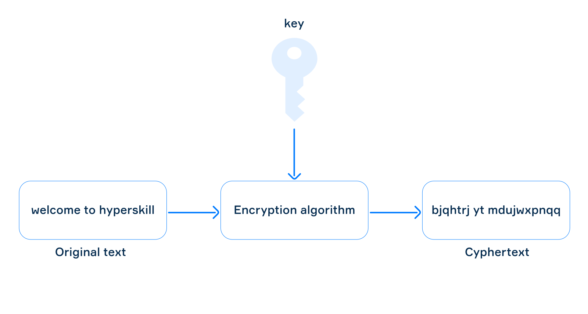

# Stage 2/6: Knowledge is key
## Description
In this stage, the encryption will be controlled by a key, a special parameter that controls the behavior of our encryption algorithm. See the picture below for more information.

Encryption process in the Encryption-Decryption program



<div style="text-align: center; font-size: small">The encryption process</div>


The key is assumed to mean that if a person knows the value of the key, they will be able to decrypt the text, and if they do not know it, they will not be able to decrypt the text. It's like a real key that can open up access to the message text.

## Objectives
Write a program that reads an English message and an integer number (key) from the standard input and shifts each letter by the specified number according to its order in the alphabet. If you reach the end of the alphabet, start back at the beginning (a follows z).

The English alphabet is below:

`abcdefghijklmnopqrstuvwxyz`

The program should not modify non-letter characters.

## Example
The greater-than symbol followed by a space (`>` ) represents the user input. Note that it's not part of the input.
```
> welcome to hyperskill
> 5
bjqhtrj yt mdujwxpnqq
```
